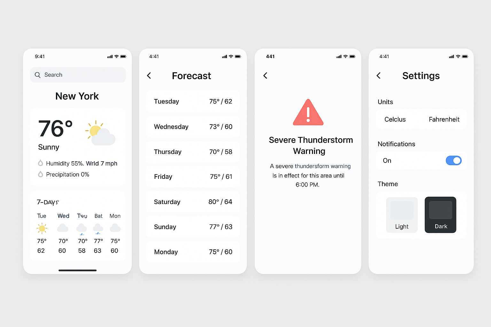

# Capstone

## Outline of your chosen app idea
A wheather forecasting app that provides real-time weather updates, forecasts, and alerts for multiple locations.
## Features
- Real-time weather updates including temperature, humidity, wind speed, and precipitation.
- 7-day weather forecast with detailed daily and hourly information.
- Weather alerts for severe conditions such as storms, heavy rain, and extreme temperatures.
- Ability to save and manage multiple locations for quick access to weather information.
- User-friendly interface with intuitive navigation and visually appealing design.
## UI Design
The user interface consists of the following components:
- A search bar for adding and managing locations.
- A main dashboard displaying current weather conditions for the selected location.
- A forecast section showing the 7-day weather outlook with icons and temperature ranges.
- An alerts section highlighting any active weather warnings or advisories.
- Settings menu for customizing units (Celsius/Fahrenheit), notification preferences, and theme options.

